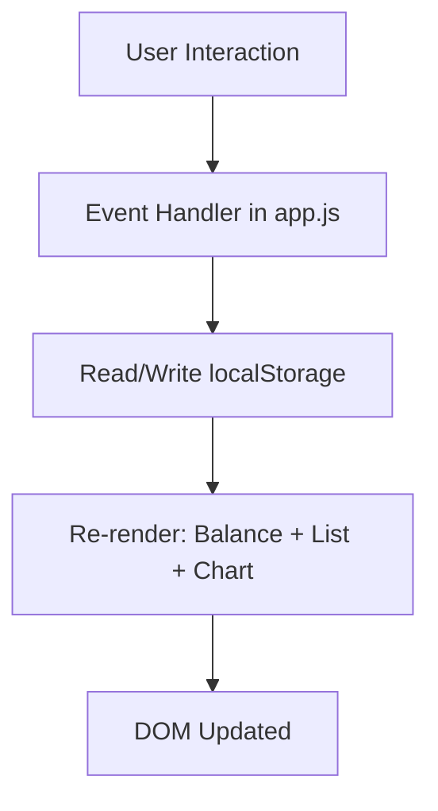

# Design Document

## Overview

The Expense Tracker is a single-page web application built with HTML, CSS, and Vanilla JavaScript. It runs entirely in the browser with no backend — all data is persisted in `localStorage` as JSON. Users can add and delete transactions (name, amount, category), see a live total balance, and view a pie chart of spending by category powered by Chart.js.

The app is structured as three files:
- `index.html` — markup and Chart.js CDN import
- `css/style.css` — all styles
- `js/app.js` — all logic (storage, rendering, event handling)

---

## Architecture

The app follows a simple unidirectional data flow:

```
User Action → Update Storage → Re-render UI
```

There is no framework or virtual DOM. Every state change triggers a full re-render of the affected UI regions (transaction list, balance, chart). This keeps the logic simple and predictable.



**Key design decisions:**
- Single source of truth: `localStorage` is the only state store. The in-memory array is always derived from it.
- No module bundler: all code lives in one `app.js` file, loaded as a plain `<script>` tag.
- Chart.js loaded via CDN to avoid any build step.

---

## Components and Interfaces

### 1. Storage Module (functions in `app.js`)

Responsible for reading and writing transactions to `localStorage`.

```js
// Returns Transaction[] or [] on error
function loadTransactions(): Transaction[]

// Serializes and saves Transaction[] to localStorage
function saveTransactions(transactions: Transaction[]): void
```

### 2. Validation

Validates form input before any storage write.

```js
// Returns { valid: boolean, errors: string[] }
function validateForm(name: string, amount: string, category: string): ValidationResult
```

Rules:
- `name`: non-empty after trimming
- `amount`: parseable as a positive finite number
- `category`: one of `"Food"`, `"Transport"`, `"Fun"`

### 3. Rendering Functions

Each render function reads from `localStorage` (via `loadTransactions()`) and updates the DOM.

```js
function renderAll(): void          // calls all three below
function renderBalance(transactions): void
function renderList(transactions): void
function renderChart(transactions): void
```

### 4. Event Handlers

```js
// Attached to form submit
function handleAddTransaction(event): void

// Attached to each delete button (event delegation on list container)
function handleDeleteTransaction(id: string): void
```

### 5. HTML Structure

```
<body>
  <header>        <!-- App title -->
  <section#balance>   <!-- Total balance display -->
  <section#chart>     <!-- Canvas for Chart.js pie chart -->
  <section#form>      <!-- Input form -->
  <section#list>      <!-- Scrollable transaction list -->
</body>
```

---

## Data Models

### Transaction

```js
{
  id: string,        // crypto.randomUUID() or Date.now().toString()
  name: string,      // non-empty, trimmed
  amount: number,    // positive finite number
  category: string   // "Food" | "Transport" | "Fun"
}
```

### Storage Schema

Stored under the key `"expense_tracker_transactions"` in `localStorage` as a JSON array:

```json
[
  { "id": "1", "name": "Lunch", "amount": 12.5, "category": "Food" },
  { "id": "2", "name": "Bus", "amount": 3.0, "category": "Transport" }
]
```

### ValidationResult

```js
{
  valid: boolean,
  errors: string[]   // human-readable error messages, empty if valid
}
```

### CategoryTotals (derived, not stored)

```js
{
  Food: number,
  Transport: number,
  Fun: number
}
```

Computed from the transaction array before passing to Chart.js.

---

## Correctness Properties

*A property is a characteristic or behavior that should hold true across all valid executions of a system — essentially, a formal statement about what the system should do. Properties serve as the bridge between human-readable specifications and machine-verifiable correctness guarantees.*

### Property 1: Validation rejects all invalid inputs

*For any* combination of form inputs where at least one field is invalid (name is empty/whitespace, amount is non-positive or non-numeric, or category is not one of "Food", "Transport", "Fun"), the `validateForm` function SHALL return `valid: false` and the transaction SHALL NOT be written to storage.

**Validates: Requirements 1.1, 1.4**

---

### Property 2: Transaction add round-trip

*For any* valid transaction (non-empty name, positive amount, valid category), after calling `saveTransactions` with it appended to the list, calling `loadTransactions` SHALL return a list that contains a transaction with equivalent `name`, `amount`, and `category` fields.

**Validates: Requirements 1.2, 2.3**

---

### Property 3: Form resets after valid submission

*For any* valid form submission, after the transaction is added, all form input fields SHALL be reset to their default/empty state.

**Validates: Requirements 1.5**

---

### Property 4: List rendering completeness

*For any* non-empty array of transactions, the rendered transaction list HTML SHALL contain each transaction's `name`, `amount`, and `category`, and SHALL include a delete control for each entry.

**Validates: Requirements 2.1, 3.1**

---

### Property 5: Delete removes transaction from storage

*For any* transaction that exists in storage, after calling the delete handler with that transaction's `id`, `loadTransactions` SHALL return a list that does not contain a transaction with that `id`.

**Validates: Requirements 3.2**

---

### Property 6: Balance equals sum of all amounts

*For any* array of transactions (including the empty array), the balance value computed by the app SHALL equal the arithmetic sum of all `amount` fields. When the array is empty, the balance SHALL be zero.

**Validates: Requirements 4.1, 4.3**

---

### Property 7: Category aggregation correctness

*For any* array of transactions, the category totals computed for the chart SHALL equal the sum of `amount` for each category group, and the sum of all category totals SHALL equal the total balance.

**Validates: Requirements 5.2**

---

### Property 8: Storage serialization round-trip

*For any* array of valid Transaction objects, serializing to JSON and then deserializing SHALL produce an array of objects with equivalent `id`, `name`, `amount`, and `category` fields. When storage contains malformed or missing JSON, `loadTransactions` SHALL return an empty array.

**Validates: Requirements 6.1, 6.2, 6.3, 6.4**

---

## Error Handling

| Scenario | Behavior |
|---|---|
| `localStorage` unavailable (e.g. private mode, quota exceeded) | `loadTransactions` returns `[]`; `saveTransactions` catches the error silently and shows a non-blocking warning banner |
| Malformed JSON in storage | `JSON.parse` wrapped in try/catch; returns `[]` and shows warning |
| Invalid form submission | Inline validation errors shown; no storage write |
| Chart.js not loaded (CDN failure) | Chart section shows fallback text; rest of app functions normally |
| `crypto.randomUUID` unavailable | Falls back to `Date.now().toString() + Math.random()` for ID generation |

---

## Testing Strategy

Since this project has no build tooling or test runner setup, the testing strategy is described for future implementation using a lightweight test setup (e.g. a `test.html` file with a PBT library loaded via CDN, or a minimal Node.js test script).

### Unit Tests

Focus on specific examples, edge cases, and integration points:

- `validateForm("")` returns invalid
- `validateForm("Lunch", "12.5", "Food")` returns valid
- `validateForm("Lunch", "-5", "Food")` returns invalid (negative amount)
- `validateForm("Lunch", "12.5", "Other")` returns invalid (bad category)
- `loadTransactions` with malformed JSON returns `[]`
- `renderBalance([])` produces "0" or "$0.00"
- `renderList([])` produces empty-state message
- Chart empty-state shown when transaction list is empty

### Property-Based Tests

Use a property-based testing library such as [fast-check](https://github.com/dubzzz/fast-check) (loadable via CDN or npm).

Each property test MUST run a minimum of **100 iterations**.

Each test MUST be tagged with a comment in the format:
`// Feature: browser-local-storage-app, Property N: <property_text>`

| Property | Test Description |
|---|---|
| Property 1 | Generate random invalid inputs; assert `validateForm` returns `valid: false` and storage is unchanged |
| Property 2 | Generate random valid transactions; save then load; assert the transaction is present |
| Property 3 | Generate random valid submissions; assert all form fields are empty after submit |
| Property 4 | Generate random transaction arrays; assert rendered HTML contains all fields and delete controls |
| Property 5 | Generate random transaction lists; delete one; assert it's absent from `loadTransactions` result |
| Property 6 | Generate random transaction arrays; assert `computeBalance(txns) === txns.reduce((s,t) => s + t.amount, 0)` |
| Property 7 | Generate random transaction arrays; assert sum of category totals equals total balance |
| Property 8 | Generate random valid transaction arrays; assert `loadTransactions(saveTransactions(txns))` deep-equals original |

**Note:** Properties 3 and 4 involve DOM assertions and require a DOM environment (jsdom or a real browser test runner). Properties 1, 2, 5, 6, 7, and 8 are pure logic tests that can run in Node.js.
